# Weekly progress journal

## Instructions

In this journal you will document your progress of the project, making use of weekly milestones. In contrast to project 1, you will need to define yourself detailed milestones.

Every week you should

1. define **on Wednesday** detailed milestones for the week (according to the
   high-level milestones listed in the review issue).
   Then make a short plan of how you want to 
   reach these milestones. Think about how to distribute work in the group, 
   what pieces of code functionality need to be implemented. 
2. write about your progress **before** the Tuesday in the next week with
   respect to the milestones. Substantiate your progress with links to code,
   pictures or test results. Reflect on the relation to your original plan.

Note that there is a break before the deadline of the first week review
issue. Hence the definition of milestones and the plan for week 1 should be
done on or before 15 April.

We will give feedback on your progress on Tuesday before the following lecture. Consult the 
[grading scheme](https://computationalphysics.quantumtinkerer.tudelft.nl/proj2-grading/) 
for details how the journal enters your grade.

Note that the file format of the journal is *markdown*. This is a flexible and easy method of 
converting text to HTML. 
Documentation of the syntax of markdown can be found 
[here](https://docs.gitlab.com/ee/user/markdown.html#gfm-extends-standard-markdown). 
You will find how to include [links](https://docs.gitlab.com/ee/user/markdown.html#links) and 
[images](https://docs.gitlab.com/ee/user/markdown.html#images) particularly
useful.

## Week 1
(due before 21 April)

### Plan of the week / Milestones

- Think about the data types and structures we will be using (e.g. how to store the lattice, the values of the spins...). 
- Compartimentalize the code into functions to improve readability of the code. 
- Start implementing the Metropolis algorithm for a 2 dimensional finite lattice. For that, we first need to initialize the system in a random manner (infinite temperature). 
- Figure out the most efficient manner of calculating change in energy and by extension, the acceptance probabilities.
- Exhibit that detailed balance is fulfiled by our implementation.

### Work of the week

#### Ignacio
- Standardized the representation of the lattice as an int numpy array. We use a frame of zeros around the lattice to make coding simpler and faster. 

- Created the `lattice_energy` function  that calculates the total energy of the initialized lattice [Line 50-66](https://gitlab.kwant-project.org/computational_physics/projects/Project-2---Ising_idonfernandezg_smitchaudhary_ysotiropoulos/-/blob/master/skeleton.py#L50-66-).

#### Smit
- Tested the initialization of the the lattice and the interaction energy which is the most tricky to get right.

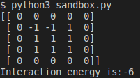

- Created the `diff_energy` function that calculates the difference in energy if a particular spin is flipped [Line 78-102](https://gitlab.kwant-project.org/computational_physics/projects/Project-2---Ising_idonfernandezg_smitchaudhary_ysotiropoulos/-/blob/master/skeleton.py#L78-102-). We believe this is very convenient because we only have to calculat the total energy once at the beginning, and then we can keep track of the energy by adding the difference in energy every time we transition to a new state.

#### Yorgos
- Tested the `diff_energy` function in sandbox.py.

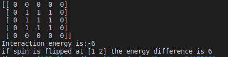

- Implemented the transition to the new state according to the Metropolis algorithm [Line 39-45](https://gitlab.kwant-project.org/computational_physics/projects/Project-2---Ising_idonfernandezg_smitchaudhary_ysotiropoulos/-/blob/master/skeleton.py#L39-45)

-The detailed balance condition is satisfied by our implementation because the ratio of probability is same as ratio of being in those two states. Which in turn, is ratio of the boltzmann factor. As can be seen in line [Line 42](https://gitlab.kwant-project.org/computational_physics/projects/Project-2---Ising_idonfernandezg_smitchaudhary_ysotiropoulos/-/blob/master/skeleton.py#L42)
, the transition probabilities are proportional to the ratio of Boltzmann factor.
-Future plans: we plan to use the magnetization and the specific heat to validate our results next week. We will also study whether the phase transitions happen as they are supposed to.

## Week 2
(due before 28 April)

### Plan of the week / Milestones

- Tweak our implementation to satisfy periodic boundary conditions instead of a frame of zeros around the lattice.
- Complete simulation by iterating MC routine. Make sure everything works.
- Validate our implementation and study observables (Average magnetisation, etc).
- Demonstrate a phase transition and compare critical temperature with the literature.
- Calculate susceptibility and specific heat of the system.

### Work of the week

#### Ignacio
- Implemented the function `avg_equil_observable()` [Line 56-72](https://gitlab.kwant-project.org/computational_physics/projects/Project-2---Ising_idonfernandezg_smitchaudhary_ysotiropoulos/-/blob/master/observables.py#L56-72) that returns the equilibirum value of a given observable in the simulation. We assume that equilibrium is reached before the last 10% of the simulation time. The time average is taken over this 10% time interval. The equilibrium is correctly reached, as shown in the following graphs, where both the magnetization and the energy is plotted over the time of the simulation. We select simulation parameters such that the system is below critical temeperature. ( H=0, J=1, T=0.5 in natural units)

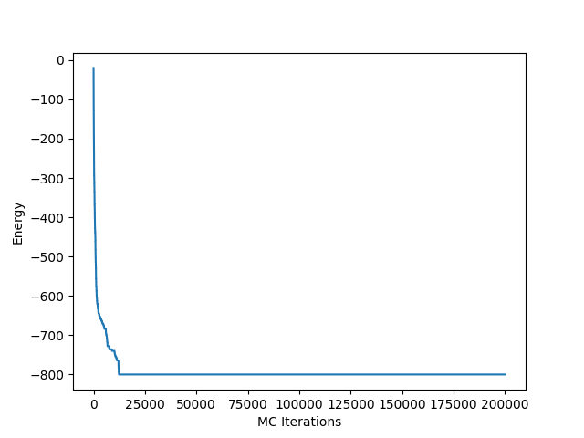

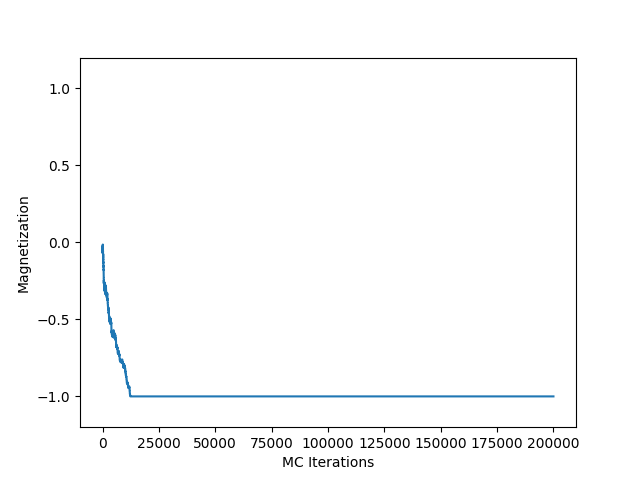

#### Yorgos
- Magnetization and Energy are now tracked throughout the simulation [Line 53-62](https://gitlab.kwant-project.org/computational_physics/projects/Project-2---Ising_idonfernandezg_smitchaudhary_ysotiropoulos/-/blob/master/skeleton.py#L53-62).

- Implemented the `susceptibility()` [Line 4-28](https://gitlab.kwant-project.org/computational_physics/projects/Project-2---Ising_idonfernandezg_smitchaudhary_ysotiropoulos/-/blob/master/observables.py#L4-28) and `specific_heat()` [Line 30-54](https://gitlab.kwant-project.org/computational_physics/projects/Project-2---Ising_idonfernandezg_smitchaudhary_ysotiropoulos/-/blob/master/observables.py#L30-54) functions. 

#### Smit
- Demonstrated that the simulation does undergo phase transitions. For this, we plot the magnetisation vs the temperature in the following graph. We can see that the phase transition occurs for a temperature of aroun 2.3 (natural units), which corresponds to a \\( J\beta \\) of approx 0.44, which is in agreement with the literature (Jos Thijssen's notes)

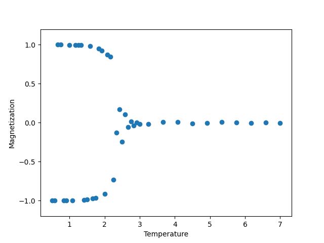

- Plotted the specific heat and susceptibility as a function of the temperature. The results are also in agreement with the literature. 

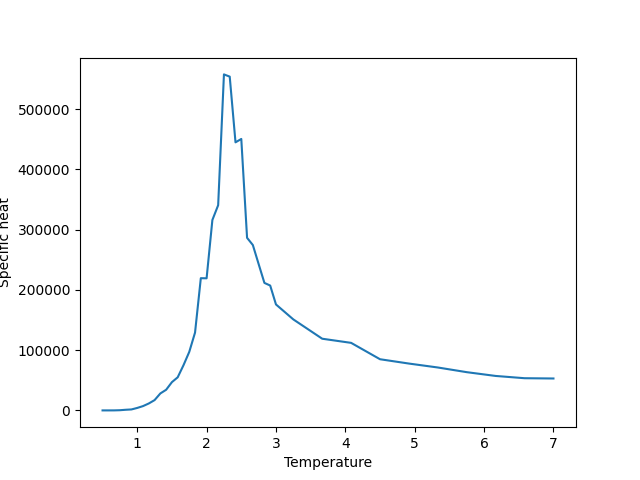
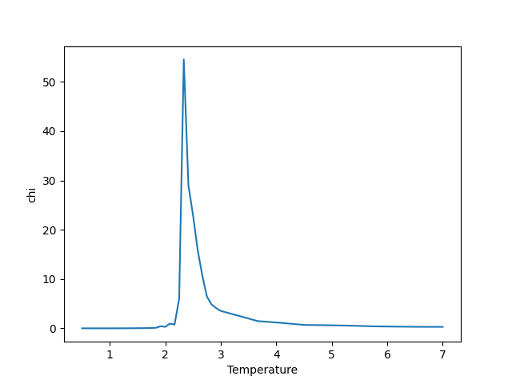

## Week 3
(due before 5 May)
### Plan of the week / Milestones

- Fix the units of the specific heat.
- Implement a function to caculate the error of the different observables
- Start working on the extension of the project. We have chosen to further study the critical exponents.

### Work of the week

#### Smit and Ignacio
- Implemented function to compute the errors of the observables, taking in account the correlation between the data  [Line 87-138](https://gitlab.kwant-project.org/computational_physics/projects/Project-2---Ising_idonfernandezg_smitchaudhary_ysotiropoulos/-/blob/master/observables.py#L87-138)

- Plotted the error bars with the metropolis algorithm. We can see the error bars are big close to the critical region.
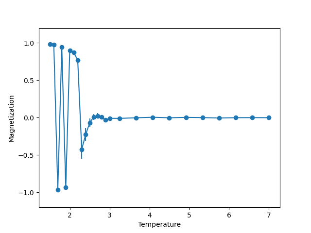
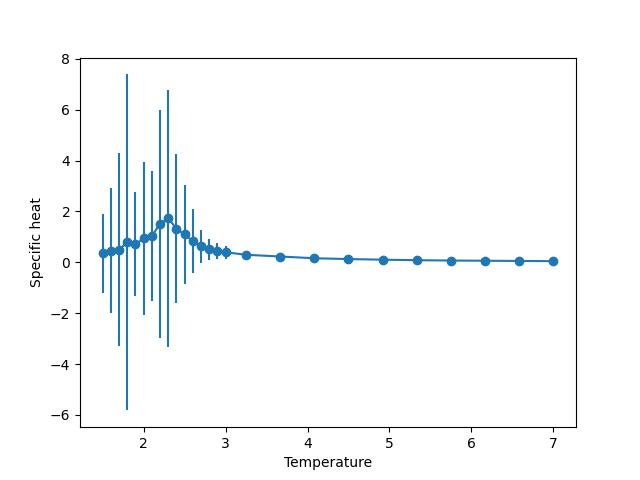
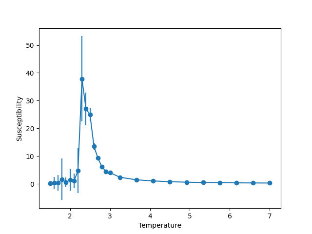

### Yorgos
- Finally we decided to implement Wolffs algorithm and not study the critical exponents [Line 147-172](https://gitlab.kwant-project.org/computational_physics/projects/Project-2---Ising_idonfernandezg_smitchaudhary_ysotiropoulos/-/blob/master/skeleton.py#L147-172). The following plots are obtained by using Wolff's algorithm in the critical region 2,1<T<3 and metropolis otherwise

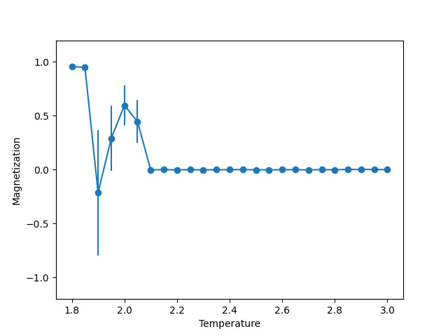
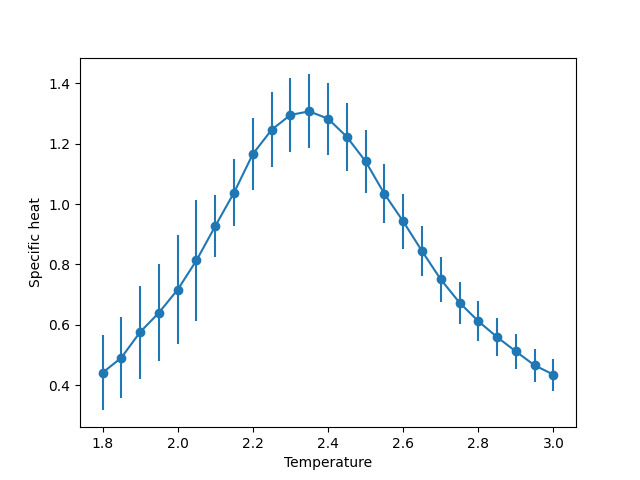
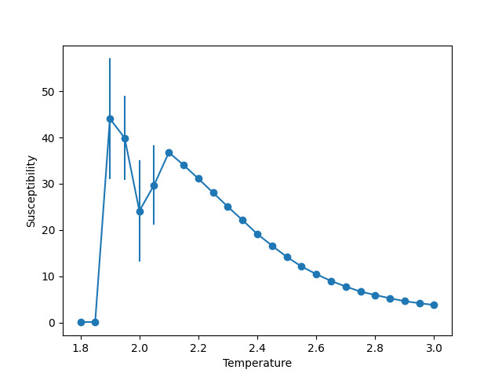

- Implemented functionality to collect data and save it [Line 84-90](https://gitlab.kwant-project.org/computational_physics/projects/Project-2---Ising_idonfernandezg_smitchaudhary_ysotiropoulos/-/blob/master/collect_data.py#84-90)